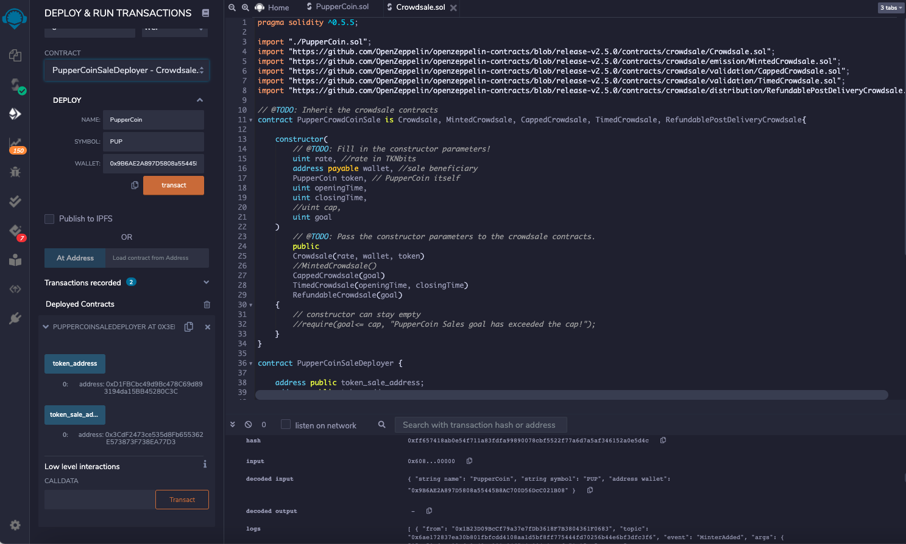
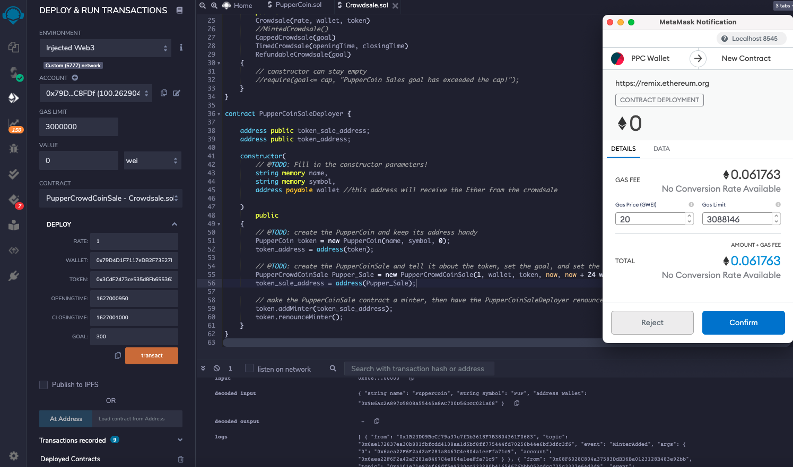
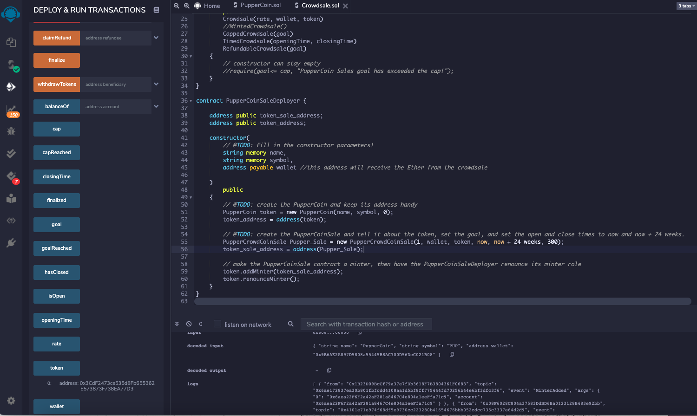
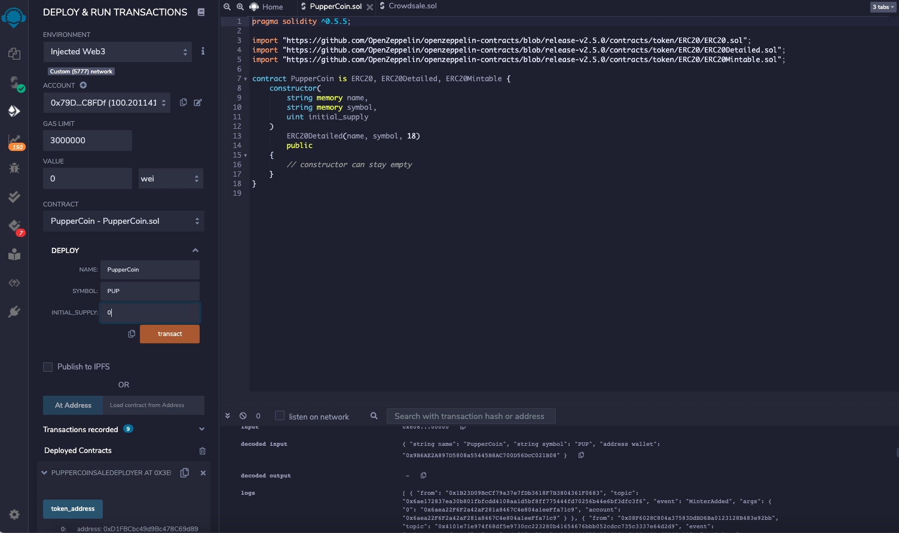
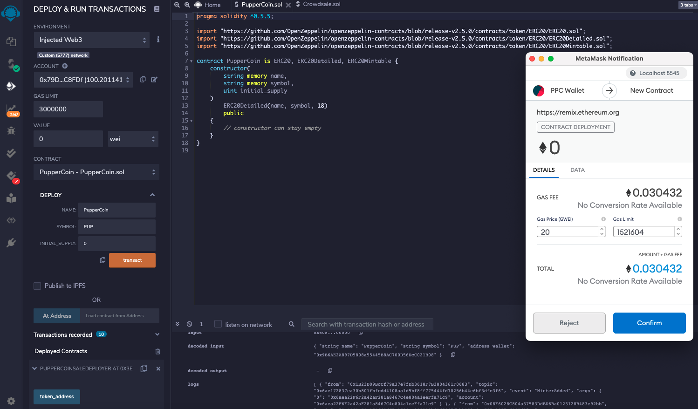
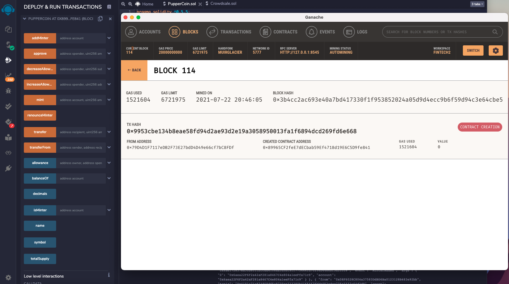
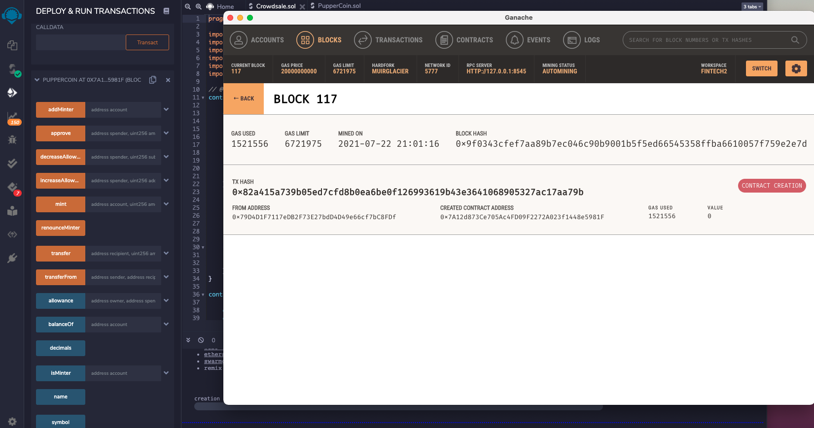

### CrowdSale and Minting ERC-20 (PUP) Tokens

## Code for Crowdsale.sol, and deployment of "PupperCoinSaleDeployer" Smart Contract

### Deployment of "PupperCrowdCoinSale" contract

### Deployment of Smart Contract and associated input variables to allow interaction and send transactions

### Deployment of "DeployedPupperCoinToken"

### Transaction is reflected in MetaMask and PUP Token creation confirmed

### Deployed PupperCoin and confirmation of contract deployment in Ganache (Block 114)

### PupperCoin is fully interactive and transactions confirmed in Ganache (Block 117)

